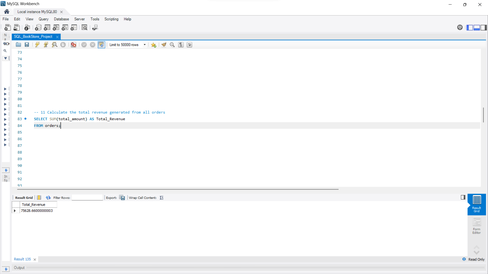
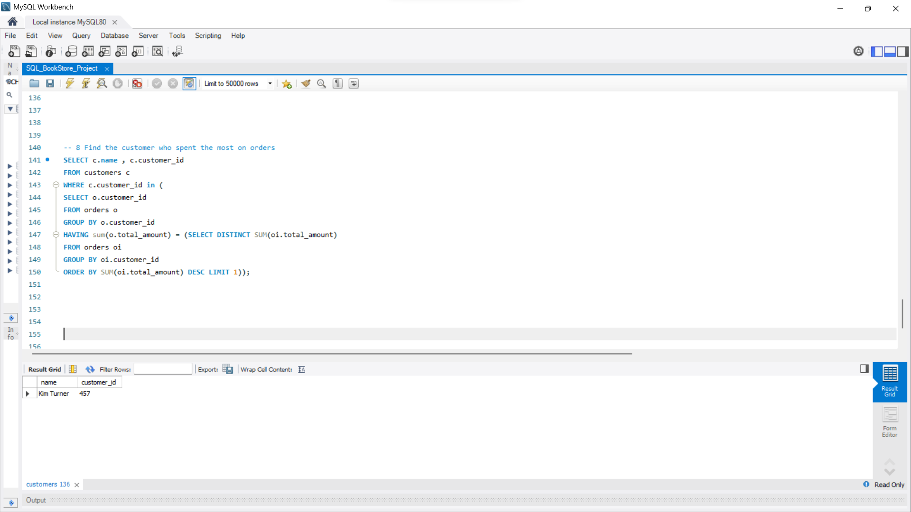

## Project Screenshots

### Total Revenue Analysis

### Highest Spending Customer

### Most Ordered Book

# Book Store Data Analysis using SQL

## Project Overview

This project analyzes a bookstore database using MySQL. The database consists of three datasets: Books, Customers, and Orders. SQL queries were written to extract business insights related to sales, inventory, customer behavior, and revenue generation.

## Dataset

The project uses three CSV files:

* Books.csv
* Customers.csv
* Orders.csv

## Database Schema

Tables Used:

* Books
* Customers
* Orders

## SQL Concepts Applied

* Joins (INNER JOIN, RIGHT JOIN)
* Aggregate Functions (SUM, AVG, COUNT)
* GROUP BY
* HAVING
* Subqueries
* DISTINCT
* COALESCE

## Business Questions Solved

### Basic Analysis

1. Retrieve books by genre.
2. Find books published after a specific year.
3. Identify customers from a particular country.
4. Analyze orders by date.
5. Calculate total stock available.
6. Find the most expensive book.
7. Identify bulk purchases.
8. Retrieve high-value orders.
9. List available genres.
10. Find books with lowest stock.
11. Calculate total revenue.

### Advanced Analysis

1. Total books sold by genre.
2. Average book price by genre.
3. Customers with multiple orders.
4. Most frequently ordered book.
5. Top expensive books in Fantasy genre.
6. Total books sold by author.
7. Cities with high-spending customers.
8. Highest spending customer.
9. Remaining stock after fulfilling orders.

## Key Insights

* Identified best-selling books and genres.
* Calculated total revenue generated from sales.
* Tracked customer purchasing behavior.
* Evaluated inventory levels after order fulfillment.

## Tools Used

* MySQL
* SQL
* CSV Files

## Author
Himanshi Singh

